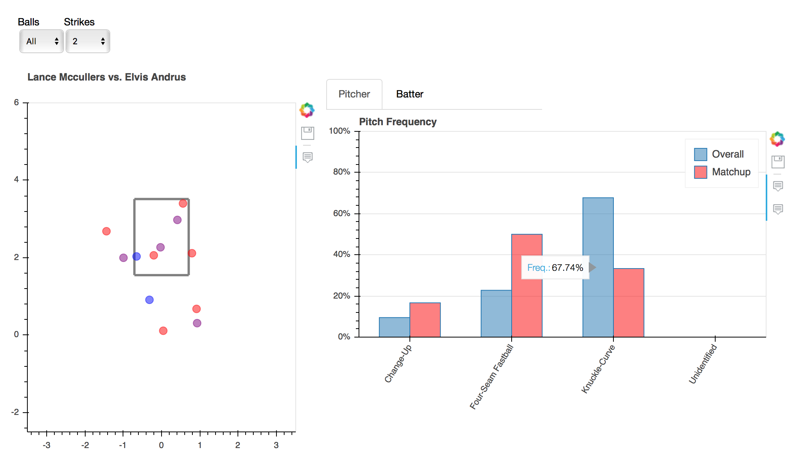

# Building Dashboards with PyBaseball and Bokeh

---

Since the adoption of Statcast by Major League Baseball, fans have had access to pitch-by-pitch data for every regular season game.
These data include pitch velocity and location, the result of the pitch, even who was playing left field at the time.
Numerous tools have been built to access these data, most notably [Baseball Savant](https://baseballsavant.mlb.com), which provides a relatively straight forward user interface for finding the information you want.

I recently came across [PyBaseball](https://github.com/jldbc/pybaseball), a lightweight Python package that makes it simple to access Statcast as well as Baseball Reference and Fan Graphs.
To give the package a spin, I created a simple dashboard using [Bokeh](https://bokeh.pydata.org/en/latest/) widgets for the UI and PyBaseball for the data collection.
This post aims to serve as a simple introduction to the dashboard and an overview of the steps I went through creating it. All of the code is available on [GitHub](https://github.com/andersonfrailey/mlbdashboards)
as well.

## Dashboard

The dashboard presents a very simple user interface. A user searches for a pitcher and batter, selects the appropriate name from the dropdown menus, selects the desired data range, and then the two Bokeh figures auto populate when the user clicks run.

On the left you have the location of each pitch between the two selected players in the specified time frame from the catcher's perspective, color coded by pitch type. Hovering over a pitch provides information on the pitch type, count, velocity, and result of the pitch.

On the right, there are two bar charts depicting pitch frequency. For pitchers, the percent of the time they threw each of their pitches against the individual batter and through the entire time frame. For the batter, the percent of the time they saw each type of pitch from the individual pitcher and from all pitchers faced in the time frame. Naturally, there are more unique pitch types displayed for the batter than the pitcher.

The data streaming into both plots can be filtered by count using the ball and strike selectors above them.
For example, in the search above, you can see that although only about a third
of the two strike pitches Lance McCullers threw to Elvis Andrus in 2017were knuckle-curves,
close to 70 percent of his two-strike pitches were knuckle-curves (with good reason.
That thing is dirty).

### Running the Dashboard

The dashboard relies entirely on Bokeh. To run it, all you need to do is navigate
to the folder the Python script is saved and run `bokeh serve baseballmatchups.py`.
You will need to be using Python 3.6 for everything to run.

## PyBaseball

I ultimately only needed three modules from PyBaseball: `playerid_lookup`, `statcast_pitcher`, and `statcast_batter`.

`playerid_lookup` does exactly what the name implies: finds the ID number of a given player. The module returns a Pandas DataFrame containing the MLB Advanced Media (MLBAM), Baseball Reference, and Retrosheet ID numbers as well as their first and last year in the majors. These are pulled from a database hosted by [Chadwick Baseball Bureau](http://chadwick-bureau.com).
The dataset provided by Chadwick Baseball includes players who never actually competed in the majors. To account for this in the dashboard I filtered out any player with a null value for their first year in the majors.
One significant problem I still haven't decided on a solution for at this time is how to handle players with the same name. Right now I just include the player's MLBAM ID, but that is only useful if you know what that even means.
I'm considering using some of the other search modules in PyBaseball to find a player's most recent team and including that in the dropdown.

The other two modules used - `statcast_pitcher` and `statcast_batter` both pull Statcast data for the players.
Using the MLBAM ID and start and end dates for your query, they fetch pitch level data from Statcast and return it in a nice DataFrame.
Once you have that, it can be filtered as needed.

I found that anytime I tried to run a query for before the 2017 season I hit ran into a variety of errors. I haven't done enough digging to find their root cause at this time. For now I simply restricted the earliest search date to be April 2017.

## Bokeh

The entire UI of the dashboard was built using [Bokeh widgets](https://bokeh.pydata.org/en/latest/docs/user_guide/interaction/widgets.html). The text inputs, dropdowns, and buttons are all mapped to functions that retrieve and analyze data before pushing it to the plots.

## Future Improvements

Aside from general aesthetic improvements, there are a few technical issues I plan on working on.

First, I want to parallelize some of the queries. Everything runs pretty fast as is, but I see no reason why the data munging that goes on separately for the pitcher and batter can't be done at once.

Second, because I decided it would be useful to rename each event in the Statcast data (e.g. `grounded_into_double_play` becomes just `Double Play`), there is occasionally an error when the data includes and event I haven't set a key/value pair for yet. My general approach so far has been to simply add the new values as I run into them.

Third, right now the only way to see if you have an error is to look at the command line output. I want to add some sort of notification system so these bugs don't go unnoticed. This is particularly important because the search modules don't catch simple things like spelling errors.
As a result, a user has no way of knowing if they made a mistake somewhere or
if it is just taking a long time to run.

## Wrap Up

The goal of this project was to create a simple dashboard that used a few of
PyBaseball's capabilities. There are still plenty of tweaks I can make, as mentioned above,
and I welcome any feedback or contributions. If you're interested in more
baseball related applications, I highly recommend checking out [Baseball Savant](https://baseballsavant.mlb.com).
Daren Willman has put together a very expansive array of tools including a
[3D pitch visualization](https://baseballsavant.mlb.com/visuals/pitch3d) that has
very similar information to what I've created.

One last thing, I promise I don't type as slow as the GIF included earlier in this
post makes it look. For some reason when I converted the screen capture from an 
MP4 to a GIF everything became slower.
