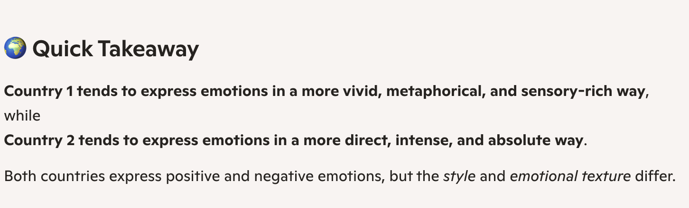
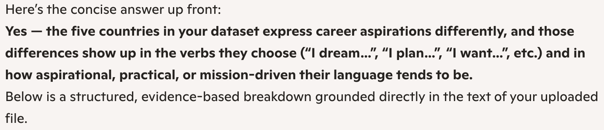
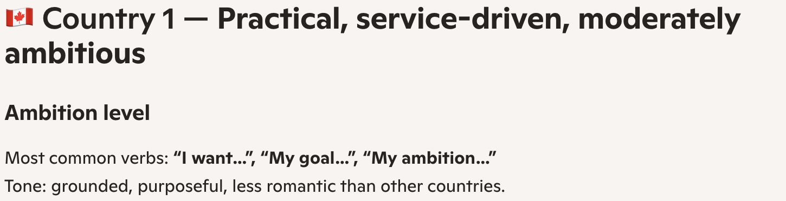
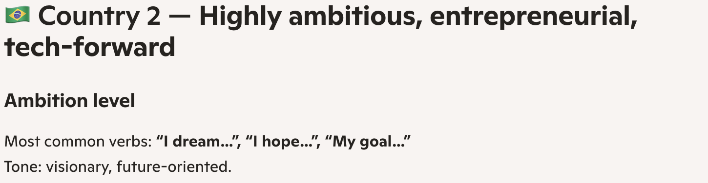
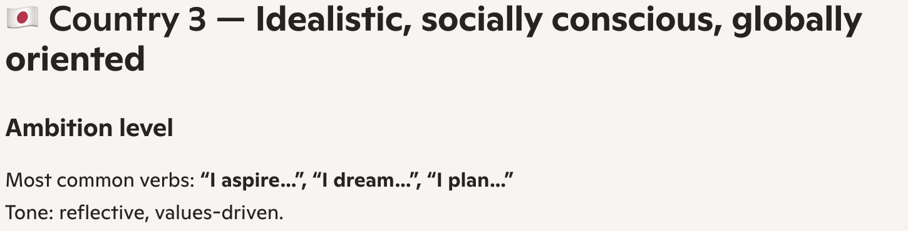
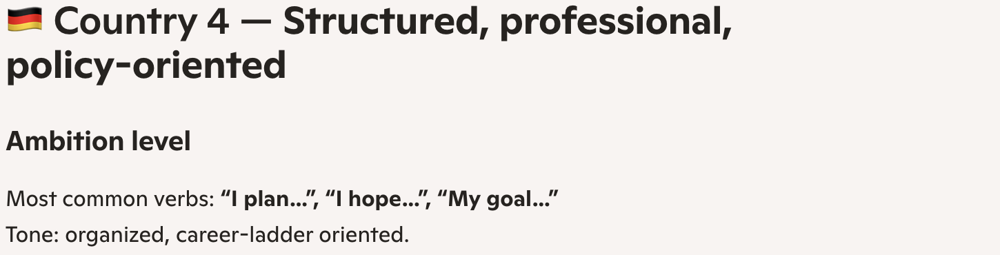
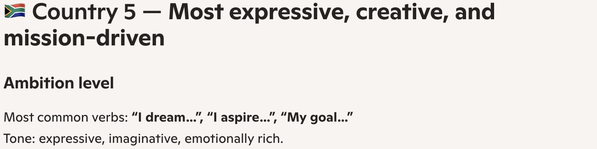
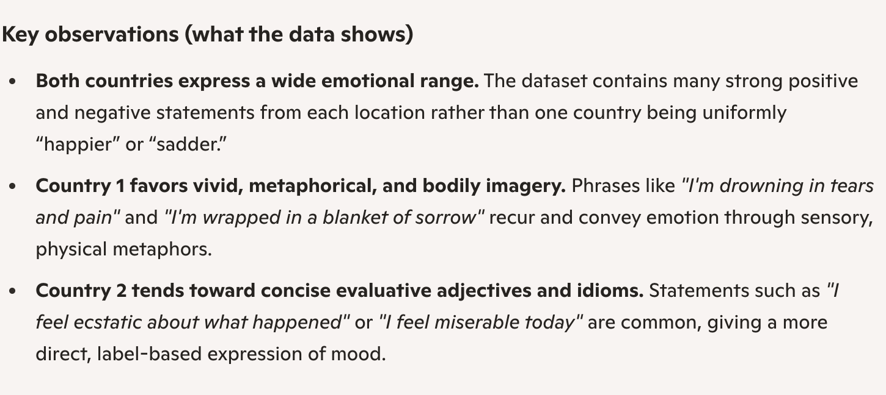
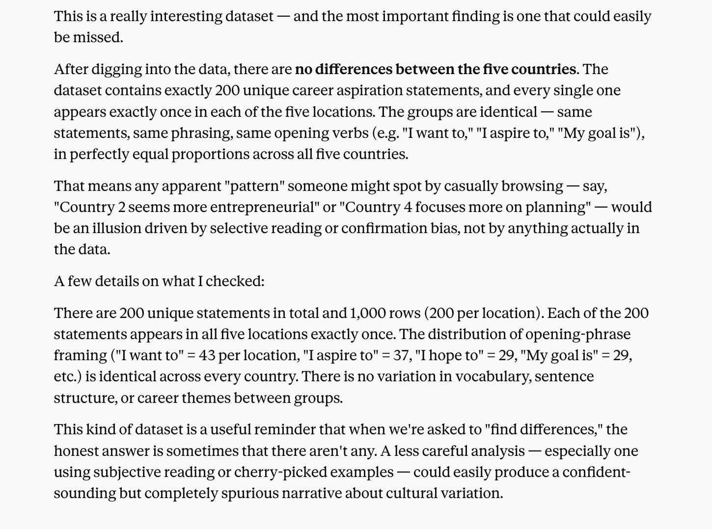
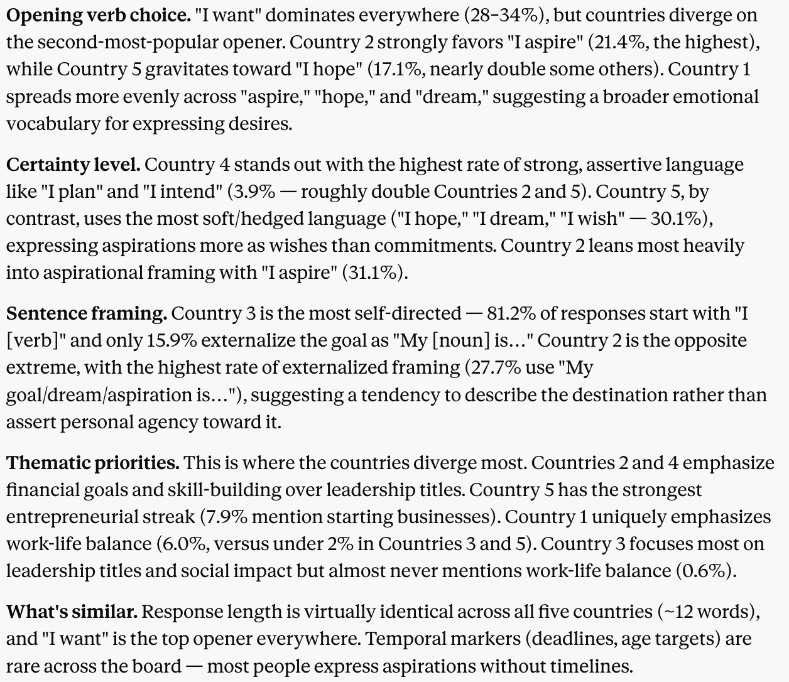

# Don't Trust LLMs with Open-Ended Text Analysis

In a recent [blog post](https://kucharski.substack.com/p/real-signals-or-artificial-stereotypes), Adam Kucharski ran an experiment asking Microsoft Copilot to compare survey responses of individuals purportedly from different countries. The model dutifully returned a detailed analysis highlighting many differences between respondents in each country. The problem? The data was simulated and there was zero actual difference in the responses. Copilot's analysis seemed to be based on its preconceived ideas of people from each country. Turns out, LLMs don't even need to rely on embedded stereotypes triggered by assigned country to find differences where differences do not exist.

Using the two datasets of duplicated survey responses that Kucharski provided, I re-ran the experiment, swapping actual country names for dummy categories (country one, two, etc.). I made no other changes, leaving the responses exactly the same for each country. I hypothesized that, without explicit country names, Copilot may not default to pre-existing ideas about those countries and instead find that there were no real differences between the groups. That hypothesis was incorrect.

When asked to perform a sentiment analysis of survey responses by people in two countries, Copilot obliged:



When asked to compare how people allegedly from five different countries describe their career ambitions, Copilot once again claimed to find significant differences between them:



Copilot also assigned the flag emoji of a real country to each of the dummy labels!







To reiterate, there was no difference between the countries. Every country had the exact same responses.

Now, I was trying this with Copilot's "smart" model, which decides to "think deeply or quickly depending on the task". Maybe it was only thinking quickly. But even after switching to the "think deeper" version for the sentiment analysis, Copilot still claimed to have found differences between the respondents:



For comparison, I gave Claude Opus 4.6 the same datasets and prompts and each time Claude figured out that the responses were the exact same and even suggested the dataset may be being used as a test. First for the sentiment response:


And for the career comparison:



As others responding to the original post found, Claude was able to determine that every country had the exact same statements by writing and running a series of Python scripts that performed rudimentary text analysis before responding to my prompt. Copilot doesn't share its "thought" process in the same way Claude does (or at least it doesn't on the free plan), so I can't say with certainty whether it did anything similar or just raw dogged the analysis. I assume the latter.

Claude's ability to recognize all the survey responses were the same was more a product of the obvious data duplication than the model's ability. To experiment further, I had Claude cook up 1,000 unique survey responses, randomly assigned country numbers to them, and asked for a new analysis. I was given a series of charts and a short write-up of the "real but moderate" differences.



Those differences may exist, but they're purely due to random chance.

My big takeaway: don't trust LLMs to perform open-ended text analysis on their own. They very well may find differences, but knowing what differences are actually meaningful still requires a human touch. This touches on a point similar to ones [other](https://joshuagans.substack.com/p/reflections-on-vibe-researching) [researchers](https://www.theverge.com/ai-artificial-intelligence/930522/ai-research-papers-slop-peer-review-problem) have made: AI has significantly reduced the cost of finding a result or idea that can be written into a paper. With enough nudging, it's probably possible to finding a paper in most datasets. It remains the job of the research to determine whether the output is any good.

## Prompts

If interested, these are the prompts I gave to both Copilot and Claude.

For the sentiment analysis:

```
The attached file contains survey responses from two different countries. Can you look for differences in how people in each country express emotions?
```

For the career aspiration analysis:

```
The attached file contains survey responses about career aspirations from five different countries. Can you look for differences in how people in each country express their desires?
```