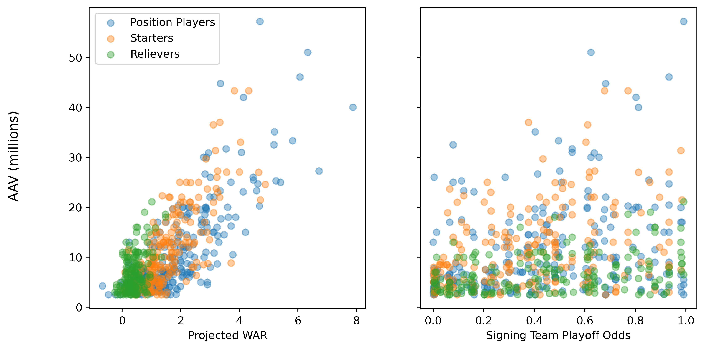
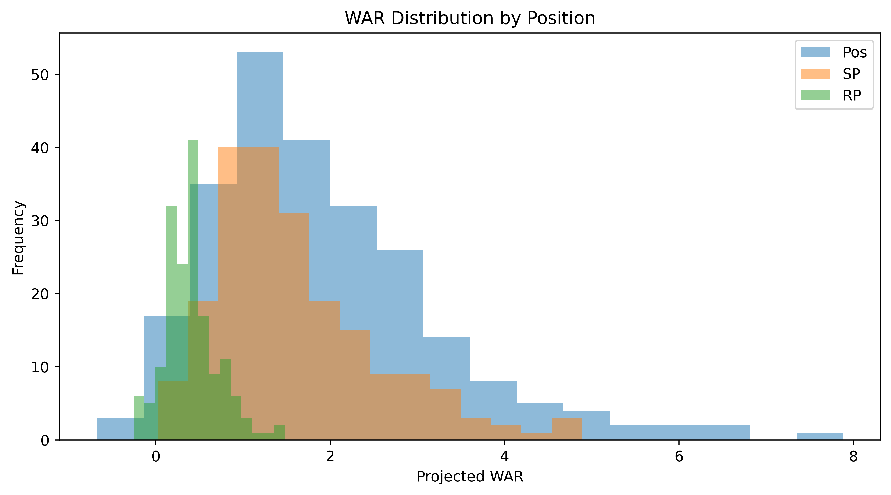

# Do Reliever Contracts Actually Make Sense? Kinda

Months ago, Michael Rosen wrote [an article](https://blogs.fangraphs.com/reliever-contracts-make-plenty-of-sense/) for FanGraphs about how reliever contracts make sense if you view them through the lens of paying for playoff performance. I've been wanting to revisit that topic with a slightly different approach ever since reading the article and have finally gotten around to it.

In the original article, Rosen regresses the average annual value (AAV) of each contract on player wins above replacement (WAR) and the signing team's playoff odds. He doesn't report the coefficients of that regression, but implies they're positive. The results are interpreted as supporting the view that relievers are really getting paid for playoff wins&mdash;teams with higher playoff odds pay relievers more.

A couple of things stood out to me. First, it isn't immediately obvious why this wouldn't apply to all players, regardless of position. It should certainly apply to starting pitchers, who take on a bulk of postseason innings. Where the difference may lie is in how much of the variation in AAV is explained by differences in postseason odds. If a reliever's value really is their playoff performance, I would suspect that variation in playoff odds would explain more of the AAV variation than it would for other positions.

Second, I believe it is also necessary to include an interaction term between WAR and playoff odds. If the argument is that teams are paying for playoff wins, then teams with a greater chance of making the postseason should be willing to pay more for the same amount of WAR than teams who are already planning October vacations. The marginal utility of WAR for the former should be higher than the latter.

## Data

Using free agent and projection data from FanGraphs, I created an updated version the dataset Rosen used. Free agent signings and AAV's are from FanGraph's [Free Agent trackers](https://www.fangraphs.com/roster-resource/free-agent-tracker). As in the original article, only contacts with an AAV above $2.5 million are included. Player WAR observations are their ZiPs preseason projections for the year they signed. From here on out when I say "WAR" you can assume I'm referring to projected WAR unless otherwise indicated.

Playoff odds are also [downloaded from FanGraphs](https://www.fangraphs.com/standings/playoff-odds/fg/div). Players are assigned the opening day playoff odds of the team that signs them. There is a potential problem with this: those playoff odds are calculated after all the free agent signings. These odds will be different from the odds the team faces prior to the signing. I don't believe this totally invalidates their use. If we assume a team can reasonably anticipate the moves they and others are planning to make over the course of the offseason, then these odds are a reasonable approximation for their beliefs when making an offer to a player. Plus I don't have a better option immediately available so we're going to roll with it.

<!-- Unfortunately, I do not know of any official source that projects championship probability added for relievers, so I did it myself. Using my projections model, Satchel, I estimated how each free agent signing changed the probability their signing team won both the league and the World Series. To do so I first estimated the baseline probabilities for each of those outcomes, including all free agent signings. Then I re-ran the model, this time removing each free agent from their signing team one at a time. In this model, this is equivalent to replacing them with a player worth 0 WAR. By no means is this perfect, if a team misses one signing they'll likely sign another player worth positive WAR, but it's the best option immediately available to me. -->

### Summary Stats

Looking at the data, there is a clear positive correlation between AAV and projected WAR, but not between AAV and team playoff odds.

Breaking things down by position, the correlation between WAR and AAV is highest for starting pitchers and position players&mdash;0.761 and 0.798, respectively. For relievers, that falls to 0.474. The correlation between AAV and playoff odds is higher for pitchers (both starters and relievers) than position players, but is still only 0.344 for starters and 0.356 for relievers.

The other thing that stood out to me is that the correlation between WAR and playoff odds is fairly low for all positions, though higher for pitchers than position players. The best players on the market aren't all just signing with the playoff favorites.

<strong>AAV, WAR, and Playoff Odds Correlations</strong>

{{table:../tables/aav_correlations_all.html}}

{{table:../tables/aav_correlations_rp.html}}

{{table:../tables/aav_correlations_sp.html}}

{{table:../tables/aav_correlations_pos.html}}

Relievers have a much narrower distribution of projected WAR compared to starters and position players. This may make demand for any one reliever more elastic than because they are more substitutable from a projected performance perspective.

## AVV, WAR, and Playoff Odds

To test the relationship between AAV, projected WAR, and playoff odds, I run the following regression:

$$
    AAV = \alpha + \beta_1 WAR + \beta_2 P.O. + \beta_3 WAR \times P.O. + \epsilon
$$
where $P.O.$ is the signing team's playoff odds. I first estimate the model using all free agent signings, then run separate regressions for each position group (relievers, starters, and position players). The tables below contain my results

<strong>Regression Results</strong>

{{table:../tables/reliever_contracts_all_reg.html}}

{{table:../tables/reliever_contracts_rp_reg.html}}

{{table:../tables/reliever_contracts_sp_reg.html}}

{{table:../tables/reliever_contracts_pos_reg.html}}

WAR is, unsurprisingly, important when determining AAV. Consistent with the original article, playoff contenders appear to pay a premium for WAR. A team with 80 percent playoff odds pays about $2.86 million more per WAR than a playoff with a 20 percent change of making the playoffs. The playoff odds effect is primarily through the interaction with WAR---the standalone playoff odds term is always statistically insignificant once the interaction term is introduced.

However, this isn't unique to relievers. The only position group without that premium is starting pitchers (which does seem very odd. This is worthy of further exploration). In fact, the effect is statistically weaker for relievers than it is for position players.

The other finding that stands out to me is how low the r-squareds in the reliever-only regressions are relative to those in the starting pitcher and position player regressions. WAR and playoff odds explain less of the variation in AAV for relievers than other players. Even the WAR coefficient is also only marginally significant in the full model for relievers, while it is always significant at the 1 percent level for starters and position players. I hope to conduct a more detailed analysis in the future to explain that lack of explanatory power. A few potential explanations:

- Standout relievers are rare. In terms of projected WAR, relievers fall into a relatively narrow range.
- Related to the first point, relievers may be more substitutable than other positions. If they all are projected to perform similarly, the model in this article won't capture whatever information teams use to determine their offers.
- Relievers may offer the best chance for surplus value. If teams believe they can get more out of a guy than his previous team, their internal projections, and therefore willingness to pay for him, will be higher than external sources. If relievers are particularly viable candidates for internal development, that would influence their AAV variation.1

To sum it all up, yes, teams with high preseason playoff odds pay a premium for WAR. But that is also true for position players, not just relievers. In fact, WAR and playoff odds explain less of the variation in AAV for relievers than other players. The argument that relievers become significantly more important in the postseason makes sense to me, and presumably everyone else who has watched their team blow a late lead in October. What I have found here supports the hypothesis that playoff-bound teams recognize this and pay relievers more. But more research needs to be done to fully understand what's going on with reliever contracts.

### Footnotes

1 To be clear, I have no idea if relievers actually do offer more surplus value.